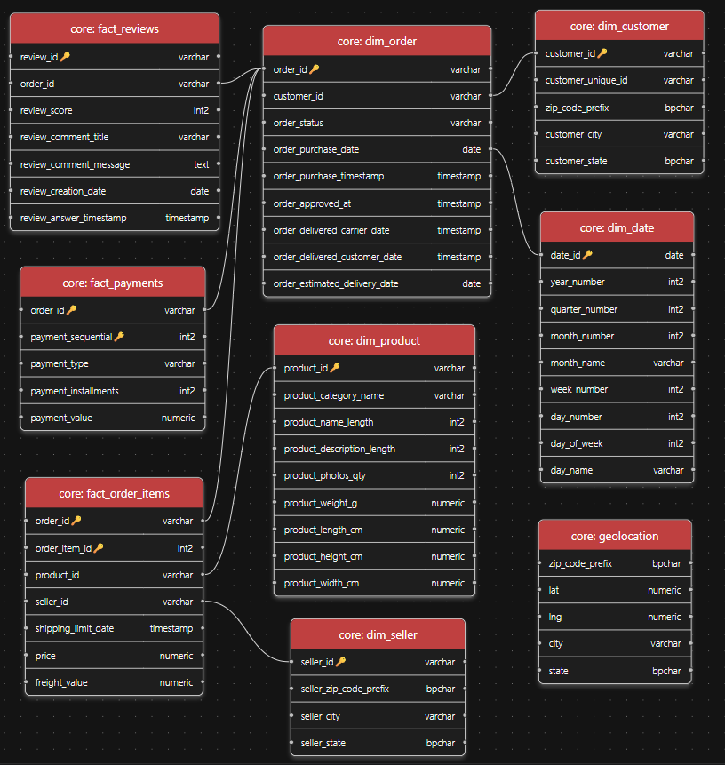

# exploration_01
    Se observan tablas con cantidades aceptables de nulos considerando el nombre de campo o columna; sin embargo, nulos significativos en una tabla de dimensión (PRODUCTS) requieren análisis extra.
        610 nulos en product_category_name
        2 nulos en campos de métricas (weight, length, height, width)
    También, 1 M de filas en GEOLOCATION se requieren revisar por potenciales duplicados
        Filas: 1,000,163
        geolocation_zip_code_prefix: 19015 únicos
        
# exploration_02
    Se evaluó la separabilidad de product_category_name mediante las métricas físicas (weight, length, height, width) usando Random Forest como diagnóstico de separabilidad (70 categorías, n=32334, StratifiedKFold k=5, class_weight=balanced).
        Accuracy=34.3%, F1-macro=22.9%.
    Aunque el modelo supera el baseline aleatorio (F1 1.4%), un 65% de error en la asignación hace la imputación no confiable para uso analítico.
        Los 610 productos sin categoría se etiquetan como "sin_categoria".

# clean_01
    Funciones para limpieza por tabla:
        zip_code_prefix: código postal fijado en 5 digitos (código más largo)
        Eliminación de duplicados de Geolocation. (Filas: 1,000,163 → 738,332)
        Normalización de strings para consistencias de joins.
        Rellenado de blancos con mediana (para las medidas físicas de los productos)
    Verificación ejecutada sobre DataFrames en memoria antes de guardar (nulos, tipo, longitud, etc.)
    Csv en /clean listos para cargarse, se deja el casteo para el DDL en SQL.
    
# load_01
    Esquema estrella definido en sql/ddl.sql y ejecutado contra PostgreSQL (de-portfolio) desde Python via psycopg2.
    Tipos de dato definidos directamente en el DDL (con base en el reporte clean_02.txt)
    9 tablas creadas:
        Dimensiones: dim_date, dim_customer, dim_seller, dim_product, dim_order
        Hechos: fact_order_items, fact_payments, fact_reviews
        Soporte: geolocation (múltiples coordenadas por zip_code, colapsar lat/lng perdería precisión geoespacial necesaria para mapas de calor en Power BI)
    Decisiones de diseño:
        dim_date generada en PostgreSQL (2016–2018 completos) para mantener el modelo autocontenido en la capa de datos.
        dim_product usará nombres de categoría en inglés, obtenidos por join con product_category_name_translation.csv al cargar.
        order_purchase_date (DATE) se usa como FK a dim_date. order_purchase_timestamp (TIMESTAMP) se conserva en dim_order para evitar errores en cálculos de tiempo de entrega cuando la aprobación cruza medianoche.
    
    * Cambio de esquema de public a core.